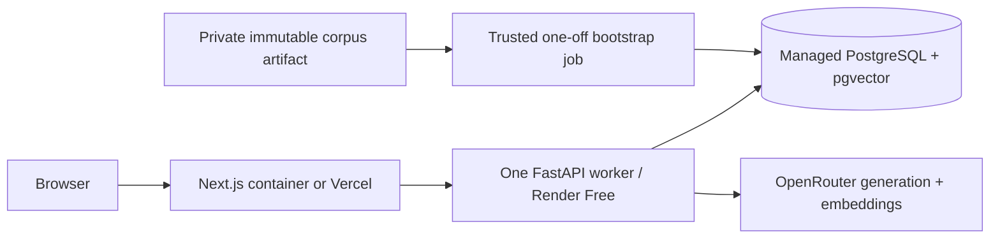
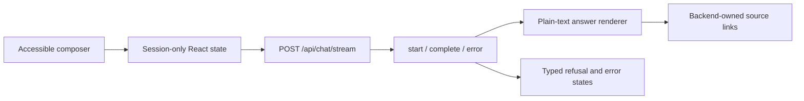
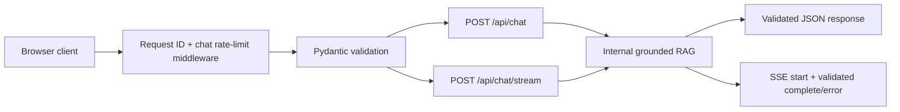
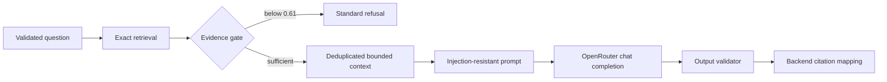

# Architecture

## Phase 9 container deployment boundary



The application remains a modular monolith. The web image contains no raw/manual corpus, processed
JSONL, secrets, or model cache. A deterministic private artifact plus a trusted one-off job bridges
that deliberate source-control boundary: the job verifies hashes, runs both offline imports, builds
vectors, verifies 10 DarGlobal documents, 10 Wasalt documents, 212 chunks, 1,024 dimensions, migration
head, and `MANUAL_PUBLIC_IMPORT` provenance, then deletes its temporary files. Public startup never
scrapes or imports.

Both application Dockerfiles are multi-stage and use digest-pinned bases. Runtime users are fixed
non-root UID/GID 10001. The initial local-BGE design measured about 451 MiB warmed and correctly
required a 2 GiB backend. For the explicitly zero-cost hiring demo, production now calls the reviewed
OpenRouter free embedding model and does not install PyTorch, sentence-transformers, or a model
cache in the image. The bounded 400-character embedding input policy and provider model name
participate in the pipeline fingerprint. This makes a single Render Free worker viable, with the
documented tradeoffs of cold starts, 512 MiB RAM, and OpenRouter's free-model availability and
50-request daily account quota. The local BGE implementation remains an optional development and
benchmark dependency, not the deployed query path.

Compose is a loopback validation topology. Its single backend performs Alembic migration before
Uvicorn for convenience. Production uses a once-per-release migration job followed by the image
`CMD`, preventing concurrent DDL across replicas. Liveness stays independent of PostgreSQL and the
model; readiness depends on PostgreSQL; OpenRouter failure is a request-level provider failure.

The local Phase 9 engine built Linux/arm64 images. A Linux/amd64 build and scan in CI or the hosting
platform remains a release requirement. Full operational steps are in `DEPLOYMENT.md`.

## Phase 7 frontend boundary



The Next.js page is a client-side product surface over the existing public contract, not a second
orchestration layer. It sends only the current message and optional fixed `darglobal`/`wasalt`
filter. Prior messages exist only for page-session continuity; no local storage, analytics, user
account, or fabricated conversational memory was added.

The fetch client parses structured SSE across arbitrary byte boundaries. `start` advances the honest
loading label from source search to answer preparation; `complete` releases the already validated
answer and citations; `error` maps backend-safe categories to distinct UI copy. Stream failure does
not trigger an automatic JSON fallback, preventing duplicate paid requests.

Model output is inert text. The renderer recognizes paragraph breaks and simple bullet-prefixed
lines but never inserts HTML. Citations are rendered separately from the backend response, and their
URLs are neither reconstructed nor inferred in the browser. External links open in a new tab with
opener isolation. Refusals remain normal assistant responses, while 429, 502, 503, 504, and network
failures receive professional, non-secret-bearing error presentation.

Semantic landmarks, labels, live regions, pressed states, focus rings, keyboard submission, reduced-
motion behavior, tap sizing, and mobile wrapping are implemented without an animation or component
framework. A concise disclosure explains corpus acquisition and freshness without overwhelming the
primary task.

## Phase 6 public API boundary



The public contract accepts only `message` and an optional `SourceName`. Extra fields are forbidden,
with a hard 10,000-character schema ceiling and a configurable operational maximum of 2,000 by
default. Message whitespace is normalized. Retrieval limits, similarity policy, prompts, model
selection, and query mechanics stay private server configuration.

Rate limiting is fixed-window and process-local. Middleware runs before request-body parsing for the
two POST routes, so malformed requests cannot bypass quota. Identity defaults to the actual socket
peer. Forwarding headers are considered only when that peer exactly matches configured trusted proxy
IPs; validated header chains are walked from right to left past known proxies. Redis was not added
for a single-instance assignment deployment. A multi-instance service needs an atomic shared limiter
or an edge/WAF policy.
Uvicorn runs with `--no-proxy-headers`; otherwise server-level rewriting could replace the socket
peer before this application policy evaluates it.

SSE is structured rather than token-level. A `start` event proves acceptance and propagates the
request ID; `complete` contains the same fully validated response as `/api/chat`; provider failures
become a safe `error` event because the HTTP 200 headers have already been sent. This retains Phase 5
output validation and never exposes partial URLs. Starlette's streaming task cancellation propagates
disconnect cancellation through the RAG call; `CancelledError` is deliberately not swallowed.

The API log adds endpoint, status, validation time, API overhead, retrieval/provider/RAG time,
refusal, resolved model, and rate-limit outcome. It excludes request bodies and context. JSON chat
responses are `no-store`; all responses retain request IDs, `nosniff`, frame denial, and the existing
referrer policy. CORS remains an explicit configured origin list with no credentials or wildcard.

PostgreSQL remains a readiness dependency. OpenRouter does not: restarting healthy instances during
a provider outage would amplify the incident and cannot repair it. Provider errors instead map to
stable `502`, `503`, or `504` chat behavior.

The local embedding model loads lazily on the first answerable or retrieval-backed request. Phase 6
measured approximately 5.8 seconds of model-load overhead; warm API overhead was 3.873 ms with
2.423 ms through validation/rate limiting. A fresh Phase 8 offline-cache process measured 11.257
seconds to construct the current model service and 437,862,400 bytes peak RSS on the development
Mac; this includes the Python/runtime stack and is a capacity estimate, not a cross-platform
guarantee. Phase 8 added an optional best-effort background preload (`EMBEDDING_PRELOAD=true`). It
uses the same locked in-process cache as requests, does not block `/health`, and falls back to lazy
loading if warm-up fails. OpenRouter remains outside readiness.

## Phase 5 grounded generation



The generation layer is a set of internal services, not a public endpoint. The app starts without
an OpenRouter key; only a generation call needs it. The client uses direct `httpx` requests to the
configurable OpenRouter API root, keeping the integration small and provider behavior explicit.
`openrouter/free` is a configurable router default rather than an assumed underlying model.

### Evidence policy and calibration

The gate uses the highest exact-cosine result and refuses below `0.61`. This is data-derived: on the
19-case retrieval benchmark, the highest top score for the two unsupported queries was `0.5854`,
the lowest top score for 17 answerable queries was `0.6300`, and their midpoint was `0.6077`.
Rounding to `0.61` preserves the observed separation. This small benchmark is not a universal
calibration guarantee; score distributions must be remeasured when the corpus, embedding model, or
question mix changes.

Comparison questions additionally require at least two distinct documents. Questions explicitly
naming both DarGlobal and Wasalt retrieve three candidates from each source before global ordering.
That targeted source-aware retrieval fixed the measured cross-source miss without globally boosting
the much smaller Wasalt corpus or changing ordinary ranking.

### Context and citations

Context is deterministic, rank-preserving, overlap-deduplicated, limited to six chunks and 7,000
text characters, and labelled `S1`, `S2`, and so on. It includes title, source organization,
canonical URL, safe property metadata, similarity, and chunk text. Markup characters are escaped so
retrieved content cannot close the source boundary.

The model is asked for a small JSON object but a citation-marker text fallback supports free models
that do not reliably honor structured output. The backend accepts only known source IDs, rejects
model-generated URLs and uncited answers, deduplicates citation IDs, and constructs final citation
objects from trusted retrieval metadata. Therefore a model never chooses a user-visible URL.

### Provider reliability and observability

The client has explicit total/connect timeouts and at most two default retries with bounded
exponential backoff. Transient transport failures, `408`, `429`, `500`, `502`, `503`, `504`, `524`,
and `529` can retry; permanent `4xx` responses do not. Failures become `LLM_TIMEOUT`,
`LLM_RATE_LIMITED`, `LLM_UNAVAILABLE`, or `LLM_INVALID_RESPONSE`, with no provider response body in
the user result. Cancellation propagates.

Structured logs record retrieval, context, generation and total latency, retrieved count, top
similarity, refusal state, resolved model, and status. They omit API keys, full questions, prompts,
and retrieved documents. See [SECURITY.md](./SECURITY.md) for trust boundaries and mitigations.

### Evaluation boundary

The checked-in generation set has 30 cases: 24 answerable and six unsupported/adversarial, covering
both sources, comparisons, hallucination traps, and prompt injection. The deterministic scripted
provider verifies the complete orchestration against real retrieval but does not measure a live
model's linguistic quality. Live evaluation is a separate opt-in command limited to five cases by
default. A final two-case live sample covered one DarGlobal and one Wasalt question: both answers,
citations, and source attributions passed. `openrouter/free` resolved independently to
`poolside/laguna-s-2.1:free` and `poolside/laguna-xs-2.1:free`; average provider latency was
2,913.132 ms. This is a connectivity and behavior sample, not enough evidence to select a
production model.

## Phase 4 vector-search foundation

The application remains a modular monolith. PostgreSQL is the system of record for both normalized
documents and their derived vectors; there is no public retrieval endpoint and no LLM integration
in this phase.

```mermaid
flowchart LR
    D[(documents)] --> C[Deterministic chunker]
    C --> E[Local BGE embeddings]
    E --> V[(document_chunks vector(384))]
    Q[Internal query] --> QE[Local query embedding]
    QE --> R[Exact cosine retrieval]
    V --> R
    R --> O[Typed chunks + scores + provenance]
```

### Embedding model

The selected model is `BAAI/bge-small-en-v1.5`, used through `sentence-transformers` on CPU. It is
an English retrieval model with 384-dimensional output. Passage embeddings are L2-normalized;
queries receive BGE's documented retrieval prefix and are also normalized. The database migration
therefore fixes the column type at `vector(384)`.

The reproducible 19-query corpus benchmark compared it with
`sentence-transformers/all-MiniLM-L6-v2` using the same 212 chunks:

| Model | Dimension | Recall@1 | Recall@3 | Recall@5 | MRR | Corpus encoding |
|---|---:|---:|---:|---:|---:|---:|
| all-MiniLM-L6-v2 | 384 | 0.7647 | 1.0000 | 1.0000 | 0.8627 | 6.0099 s |
| bge-small-en-v1.5 | 384 | 0.9706 | 0.9706 | 0.9706 | 1.0000 | 22.4625 s |

BGE is slower, but vectorization is an offline operation and its first-result quality was materially
better. The 0.9706 ceiling is caused by the deliberate cross-source query having two expected
documents while one appears in the top five; every answerable query has at least one relevant
document at rank one. The two no-answer cases are excluded from recall and MRR rather than being
misrepresented as retrieval failures.

Official references:

- [BGE model card](https://huggingface.co/BAAI/bge-small-en-v1.5)
- [MiniLM model card](https://huggingface.co/sentence-transformers/all-MiniLM-L6-v2)
- [pgvector distance operators](https://github.com/pgvector/pgvector)

### Chunking

Chunking is deterministic and line/section aware. Normalized non-empty lines remain atomic where
possible; oversized lines are split at sentence and then word boundaries. Chunks target 900
characters, retain up to 120 characters of whole-line overlap, and use 180 characters as the
preferred minimum. Short source documents remain one useful chunk rather than being padded or
dropped.

Every chunk stores source, document ID, canonical URL, title, source format, property metadata,
chunk index, parent content hash, and a pipeline fingerprint. The fingerprint combines model and
chunking configuration. Any content, metadata, model, or chunking change triggers transactional
replacement of that document's chunks.

### Storage and retrieval

`document_chunks` has a cascading foreign key to `documents`, uniqueness on
`(document_id, chunk_index)`, a document lookup index, JSONB metadata, SHA-256 chunk hashes, and a
384-dimensional vector. No HNSW or IVFFlat index is present. Exact sequential cosine search over
212 vectors is simpler, deterministic, and fast enough; an approximate index would add tuning and
recall risk without a demonstrated need.

Cosine is consistent end to end:

- embeddings are L2-normalized;
- PostgreSQL orders by pgvector cosine distance (`<=>`);
- returned similarity is `1 - cosine_distance`.

The retrieval service accepts bounded `top_k` and an optional fixed source enum. It uses SQLAlchemy
expressions and never interpolates raw SQL. Results contain chunk text, similarity, title, source,
canonical URL, and provenance metadata. CPU encoding runs off the async event loop and a process
lock serializes access to the single cached model instance.

On the 212-chunk corpus, the first real vectorization took 16.9031 seconds after a 12.8768-second
model load. The unchanged repeat took 0.1816 seconds after model load. Warm database-backed
retrieval averaged 32.737 ms across 19 queries with p95 39.836 ms; the committed standalone model
benchmark measured average BGE query embedding at 23.185 ms.

### Why PostgreSQL/pgvector

The corpus, provenance, and vectors share one transactional lifecycle. PostgreSQL provides foreign
keys, JSONB filtering, exact vector distance, backups, and operational tooling already required by
the application. A separate vector database would duplicate data and introduce synchronization,
security, and deployment work without improving this workload.

## Phase 8 production hardening

The browser, API, RAG, database, provider, and import boundaries remain one modular monolith with an
operator-only ingestion path. Hardening was added at the existing boundaries rather than by adding
new infrastructure:

- Next.js sends a CSP and modern browser hardening headers. Its SSE client checks media type,
  response shape, source host/organization, and bounded stream/event sizes before rendering.
- FastAPI rate-limits both chat routes before buffering at most 8 KB and before JSON validation.
  Unknown fields and invalid source filters remain forbidden. Production disables `/docs`, `/redoc`,
  and `/openapi.json`.
- CORS is origin-only and environment driven. Production loopback origins require an explicit escape
  hatch, and OpenRouter transport must be HTTPS.
- Service, database, embedding, provider, and malformed-output failures become safe JSON envelopes or
  SSE error events. Requests, prompts, retrieved context, and upstream bodies are not logged.
- Citation URLs are checked twice: the backend restricts them to the source-specific HTTPS allowlist,
  and the frontend independently validates the response before creating a link.
- Imports retain a 50 MB source-file cap and now also bound sidecars, PDF pages, and extracted text.
  Symlinks, unsupported types, invalid provenance, external hosts, and anti-bot content are rejected.
- API and ingestion containers stay non-root. Raw corpus, generated vectors/JSONL, caches, secrets,
  dependencies, builds, logs, local databases, and temporary files are outside the safe Git inventory.

The process-local rate limiter is sufficient only for this single-process assignment. Multiple API
workers or instances require one shared enforcement point (Redis, gateway, reverse proxy, or edge
WAF) plus deployment-specific concurrency and provider-budget controls.

### Scaling toward millions of documents

At much larger scale, vectorization would move to durable background workers with model artifacts
pinned in an internal cache, larger batches, retry/dead-letter handling, and explicit embedding
version rollouts. Retrieval would be measured under realistic filters before adding a pgvector
HNSW or IVFFlat index. HNSW offers strong query latency at higher memory/build cost; IVFFlat needs
representative training data and probe tuning. Table partitioning, read replicas, incremental
re-embedding, index build monitoring, and recall-versus-latency regression benchmarks would come
before considering an external vector service. An external service becomes justified only if
measured scale, availability, or multi-region requirements exceed PostgreSQL's operational
envelope.
