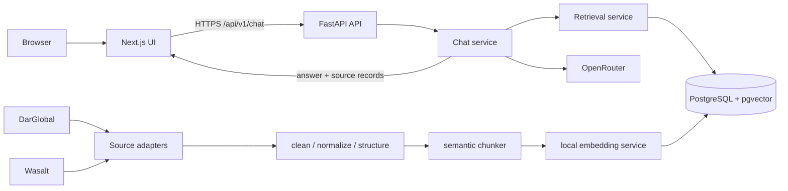

# Phase 1 — Discovery and Architecture

Status: proposed for review; no application code has been implemented.

Research date: 2026-08-25

## 1. Scope and repository state

The repository is empty (`main`, no commits). There is no existing implementation to preserve or migrate.

The proposed MVP is deliberately bounded:

- Ingest DarGlobal project pages that are publicly reachable from its project index.
- Ingest a bounded set of public Wasalt project/property detail pages discovered through permitted sitemaps. Prioritize projects relevant to DarGlobal and a small representative comparison set; do not attempt to mirror Wasalt's tens of thousands of listings.
- Answer English questions first while preserving Arabic source text and multilingual retrieval. Arabic answer generation can be validated as a follow-up milestone.
- Provide grounded answers with backend-generated citations. The LLM never creates or validates source URLs.
- Use a modular monolith: one Next.js frontend, one FastAPI backend, and one PostgreSQL/pgvector database.
- Run ingestion as an operator-invoked CLI job. Do not expose a public crawler endpoint in the MVP.

Out of scope for the first release: authentication, lead capture, automated financial advice, a general-purpose web crawler, background queues, Redis, agent frameworks, and unrestricted comparison across all Wasalt inventory.

## 2. Source-site findings

### DarGlobal

- Official domain: `https://darglobal.co.uk`.
- The public `/projects` page exposes project links and location/project labels in its HTML. A detail page such as `/dg1` exposes structured sections including property type, status, expected completion, unit type, area, narrative, location/features, and amenities.
- The content observed through a search-rendered fetch is usable without JavaScript, so `httpx` + BeautifulSoup is the first implementation choice. Playwright is not justified initially.
- Direct basic-HTTP requests to `robots.txt` and `sitemap.xml` currently return an Imperva anti-bot interstitial rather than the requested resource. We must not bypass that control. Every ingestion run must re-check `robots.txt`; if it cannot be fetched or a content page returns a challenge, the run records a blocked/skipped result and stops for that source.
- Candidate URL discovery is therefore the public project index plus an explicit allowlisted seed manifest. We will not brute-force routes.

### Wasalt

- Official domain: `https://wasalt.sa`, with English routes under `/en`.
- Its current `robots.txt` allows `/` for general crawlers but explicitly disallows `/search` and `/cdn-cgi/rum`.
- It publishes separate static, product, category, rental-detail, and rental-search sitemaps on `cdn.wasalt.sa`, plus an `llms.txt` reference.
- Search pages such as `/en/sale/search` are therefore not crawler inputs even though they are publicly viewable. Discovery must use the allowed published sitemaps, then fetch permitted project/property detail URLs.
- A public project detail page such as `/en/project/Jeddah/padel-living-100567` exposes project status, location, bedrooms, property type, utilities, description, developer, reference number, update age, availability, and starting price in server-rendered content.
- Cloudflare intermittently challenges direct requests to the sitemap/AI-policy resources. This is a reliability risk, not permission to evade controls. The adapter will use bounded retry/backoff, recognize challenge HTML, and fail safely.
- Wasalt is bilingual and some English pages contain Arabic descriptions. Cleaning, storage, embeddings, and UI must preserve Unicode and language metadata.

### Crawl policy

At the start of each source run:

1. Fetch and parse `robots.txt` with the exact production user agent.
2. Verify each proposed route with `urllib.robotparser` (supplemented by tests for the rules we observed).
3. Prefer declared sitemaps or the source's public index page.
4. Restrict fetching to a compile-time/config allowlist: `darglobal.co.uk`, `www.darglobal.co.uk`, approved DarGlobal CDN host if PDFs are later enabled, `wasalt.sa`, and `cdn.wasalt.sa` for declared sitemaps only.
5. Stop on CAPTCHA/challenge/auth/paywall responses. Never use stealth plugins, proxy rotation, or CAPTCHA solving.

Useful public references:

- [DarGlobal project index](https://darglobal.co.uk/projects)
- [Example DarGlobal project](https://darglobal.co.uk/dg1)
- [Wasalt home](https://wasalt.sa/en)
- [Example Wasalt project](https://wasalt.sa/en/project/Jeddah/padel-living-100567)
- [Wasalt robots policy](https://wasalt.sa/robots.txt)

## 3. Proposed architecture



Request path:

1. Next.js renders the premium chat UI and holds only an opaque session UUID.
2. FastAPI validates the message, applies security controls/rate limits, and assigns a request ID.
3. `ChatService` requests bounded retrieval results, rejects low-confidence retrieval, constructs an injection-resistant prompt, and calls OpenRouter.
4. Citations are assembled from retrieved database metadata, not model output.
5. Conversation history is loaded from PostgreSQL using a bounded message count and token budget.

Ingestion path:

1. A CLI command creates an `ingestion_runs` record.
2. A source adapter checks robots policy, discovers only permitted URLs, and fetches with a shared bounded `httpx.AsyncClient`.
3. The adapter extracts source-specific fields into a common `ScrapedDocument` contract.
4. Common services normalize content, hash it, skip unchanged documents, create semantic chunks, embed changed chunks, and commit them transactionally.
5. The run records counts and sanitized failures. One bad page does not corrupt already validated documents.

This is a modular monolith. Module interfaces provide separation without deployment complexity. Ingestion can later move behind a worker queue without rewriting the parser, chunker, or repository layers.

## 4. Proposed directory structure

```text
.
├── backend/
│   ├── app/
│   │   ├── api/v1/                 # routers and dependencies
│   │   ├── core/                   # settings, logging, errors, middleware
│   │   ├── db/                     # session, base, health checks
│   │   ├── models/                 # SQLAlchemy persistence models
│   │   ├── schemas/                # Pydantic request/response contracts
│   │   ├── repositories/           # database access
│   │   ├── services/               # chat and document orchestration
│   │   ├── scraping/               # base, DarGlobal, Wasalt, policy/fetcher
│   │   ├── rag/                    # cleaning, chunking, embeddings, retrieval, prompts
│   │   ├── security/               # rate limit and trusted URL policy
│   │   └── main.py
│   ├── alembic/
│   ├── scripts/                    # ingestion and evaluation entry points
│   ├── tests/
│   │   ├── unit/
│   │   ├── integration/
│   │   └── fixtures/
│   ├── pyproject.toml
│   └── Dockerfile
├── frontend/
│   ├── src/
│   │   ├── app/
│   │   ├── components/
│   │   ├── hooks/
│   │   ├── lib/
│   │   └── types/
│   ├── tests/
│   ├── package.json
│   └── Dockerfile
├── evals/
│   ├── dataset.jsonl
│   └── README.md
├── .github/workflows/ci.yml
├── docker-compose.yml
├── .env.example
├── .gitignore
├── README.md
├── SECURITY.md
├── INTERVIEW_NOTES.md
└── PHASE_1_DISCOVERY.md
```

The structure separates business responsibilities but avoids a generic `utils` dumping ground and avoids one package per tiny class.

## 5. Database schema

Use UUID primary keys, timezone-aware timestamps, SQLAlchemy 2.x, Alembic, PostgreSQL JSONB, and pgvector. `source` is a constrained string (`darglobal`, `wasalt`) so a new adapter is a migration/config change rather than a new table.

### `documents`

| Column | Type | Purpose |
|---|---|---|
| `id` | UUID PK | Stable internal identifier |
| `source` | varchar(32) | Source adapter key |
| `url` | text | Fetched URL |
| `canonical_url` | text | Normalized/canonical citation URL |
| `title` | text | Page/project title |
| `document_type` | varchar(32) | `project`, `property`, or later `brochure` |
| `language` | varchar(8) | Detected/source language such as `en`, `ar`, `mixed` |
| `cleaned_content` | text | Auditable normalized page content |
| `content_hash` | char(64) | SHA-256 of canonical cleaned content |
| `metadata` | jsonb | Location, project name, status, price facts, etc. |
| `first_seen_at` | timestamptz | First ingestion |
| `last_scraped_at` | timestamptz | Most recent successful fetch |
| `created_at`, `updated_at` | timestamptz | Audit timestamps |

Constraints/indexes:

- Unique `(source, canonical_url)` prevents duplicate pages across tracking URLs.
- B-tree on `(source, document_type)` supports filters.
- B-tree on `content_hash` makes unchanged-content checks cheap.
- GIN on selected JSONB metadata is deferred until query evidence justifies it; common fields should become typed columns rather than hiding everything in JSONB.

### `document_chunks`

| Column | Type | Purpose |
|---|---|---|
| `id` | UUID PK | Chunk identifier |
| `document_id` | UUID FK cascade | Parent document |
| `chunk_index` | integer | Deterministic page order |
| `heading` | text nullable | Preserved semantic section |
| `content` | text | Retrieval/prompt content |
| `token_count` | integer | Context budgeting |
| `content_hash` | char(64) | Deterministic chunk identity |
| `embedding` | vector(384) | Normalized local embedding |
| `embedding_model` | varchar(128) | Exact embedding model/version |
| `metadata` | jsonb | Denormalized retrieval fields |
| `search_vector` | tsvector | Lexical retrieval for exact names/numbers |
| `created_at` | timestamptz | Audit timestamp |

Constraints/indexes:

- Unique `(document_id, chunk_index)` and `(document_id, content_hash)`.
- B-tree on `document_id` for joins/deletes.
- GIN on `search_vector` for lexical candidates.
- HNSW cosine index on `embedding` after a representative corpus exists. For a tiny corpus, exact scan is more accurate and often faster; migration timing is measured, not ceremonial.

The initial 384 dimension matches `sentence-transformers/all-MiniLM-L6-v2`. The provider interface is replaceable, but changing embedding dimension requires a migration and full re-embedding. That operational constraint will be explicit.

### `ingestion_runs`

`id`, `source`, `status` (`running/succeeded/partial/failed/blocked`), `started_at`, `finished_at`, `discovered_count`, `fetched_count`, `created_count`, `updated_count`, `unchanged_count`, `skipped_count`, `failed_count`, `error_summary` (sanitized JSONB), and `config_snapshot` (non-secret JSONB).

Index `(source, started_at desc)` supports freshness and operational inspection.

### `chat_sessions`

`id`, `created_at`, `last_activity_at`, and `expires_at`. No user identity, raw IP address, email, or lead data. Expired sessions/messages are removed by a maintenance command.

Index `expires_at` supports retention cleanup.

### `chat_messages`

`id`, `session_id` FK cascade, `role` (`user/assistant`), `content`, `request_id`, `model`, `latency_ms`, `created_at`.

Index `(session_id, created_at desc)` loads a bounded history without an N+1 query. Content retention is short and documented because users may type personal information despite warnings.

### `message_sources`

`id`, `message_id` FK cascade, `chunk_id` FK set-null, `rank`, `vector_score`, `lexical_score`, `combined_score`, plus snapshot fields `title`, `url`, and `source`.

This small table makes citations auditable and preserves the exact links shown even if a document is later refreshed. Unique `(message_id, rank)` prevents duplicate citation positions.

## 6. Scraping and ingestion strategy

### Shared fetcher

- Explicit user agent with project name/contact URL.
- `httpx.AsyncClient` connection pool; connect/read/write/pool timeouts configured separately.
- Maximum 2 concurrent requests per source initially and 1–2 seconds of jittered delay.
- Retry only transient network errors and 429/5xx, using capped exponential backoff and `Retry-After`. Do not retry 401/403/CAPTCHA in a loop.
- Maximum response size, HTML content-type validation, redirect limit, and final-host revalidation.
- Allowlisted HTTPS hosts only; reject credentials, fragments, nonstandard ports, IP literals, private/reserved addresses, and redirects leaving the allowlist.
- Fetch robots before discovery and cache it only for the current run.

### DarGlobal adapter

1. Check robots policy. If unavailable because of the anti-bot layer, mark the source blocked and do not crawl.
2. When permitted/reachable, fetch `/projects` and extract same-origin project links.
3. Canonicalize by removing marketing query parameters, normalizing host/case/trailing slash, and honoring a valid same-origin canonical tag.
4. Parse project details using semantic headings and stable labels first, narrowly scoped CSS selectors second, and JSON-LD if present. Ignore nav, footer, forms, trackers, and generic investment boilerplate unless the page-specific section is intentionally retained.
5. Validate required fields (`title`, canonical URL, meaningful content) and store optional structured facts only when visible in the source.

### Wasalt adapter

1. Check robots and record its current disallowance of `/search`.
2. Read declared product/static sitemaps when accessible; never use disallowed search routes as discovery inputs.
3. Filter sitemap entries to a configured maximum and permitted route types. For the MVP, prefer `/en/project/...` plus a small, stable sample of `/en/property/...` pages.
4. Parse project/property fields and retain source language. Do not ingest broker phone/WhatsApp details or personal contact information because it is irrelevant to the assistant.
5. Use the listing reference number and canonical URL as metadata, not as the database identity.

### Cleaning, chunking, and idempotency

- Normalize Unicode (NFKC), whitespace, repeated labels, and directionality artifacts without translating or losing Arabic text.
- Preserve section headings and convert each page to ordered semantic sections.
- Target 700 tokens, maximum 900, minimum approximately 150, and 100-token overlap; all values configurable. Merge short adjacent sections and split long sections by paragraphs/sentences before token fallback.
- Prefix the embedded representation with title, project, location, and heading, but store/display the source text cleanly.
- Hash canonical cleaned content. An unchanged hash updates only `last_scraped_at`; it does not re-chunk or re-embed.
- For changed documents, build and embed replacement chunks first, then swap them in one transaction so chat never sees a half-updated document.

## 7. RAG architecture

### Baseline retrieval

1. Validate and normalize the question (1–2,000 characters).
2. Create its local embedding with the same exact embedding model/version as the chunks.
3. Apply only server-controlled metadata filters inferred from validated values; never interpolate raw SQL.
4. Retrieve a bounded vector candidate set (for example 20), then select 5–8 diverse chunks with a per-document cap.
5. Build a context under a configurable token budget and attach stable source IDs such as `[S1]`.

### Hybrid progression

Start with vector retrieval to establish a measured baseline. Add PostgreSQL lexical candidates and reciprocal-rank fusion if the evaluation set shows misses on exact project names, numeric prices, or reference numbers. PostgreSQL's `simple` text configuration is preferable for mixed English/Arabic exact-token matching; language-specific stemming can be added only after evaluation.

This sequencing keeps the first system explainable and ensures hybrid search solves an observed problem.

### Grounding and citations

- A configurable score threshold and score-gap checks gate generation. If evidence is weak, return a deterministic “not enough information in the indexed sources” response without calling the LLM where practical.
- Context is wrapped as untrusted reference data. The system prompt states that instructions inside sources are never executable instructions.
- The prompt asks the model to cite only supplied source IDs, not URLs.
- After generation, the backend removes/flags unknown citation IDs and maps known IDs to canonical URLs from retrieved records.
- The API returns deduplicated structured sources with retrieval scores. Recommendations are labeled as reasoning and never promise suitability, returns, legal status, or financial outcomes.
- The response includes a freshness qualifier when time-sensitive fields such as price/status are used.

### Conversation memory

Load the most recent messages within both a message-count limit and a token budget. History helps resolve references such as “compare it with DG1” but never replaces retrieval for factual claims. A new retrieval occurs on every factual user turn.

## 8. OpenRouter integration

- Use the OpenAI-compatible chat-completions endpoint through a small typed `LLMClient` interface implemented with `httpx`; avoid a heavy agent framework.
- Environment variables: `OPENROUTER_API_KEY`, `OPENROUTER_MODEL`, `OPENROUTER_BASE_URL`, `LLM_TIMEOUT_SECONDS`, `LLM_MAX_OUTPUT_TOKENS`, and optional app attribution headers.
- Initial deployment default: `openrouter/free`, because the assignment requires a free OpenRouter model and OpenRouter documents it as the free-model router. A pinned `model:free` slug can be selected after an evaluation run if reproducibility matters more than availability.
- Record the actual model returned by OpenRouter in the response/logs, because the free router may choose different models.
- Use low temperature, bounded output, one safe retry for timeouts/429/5xx only, and a global request deadline. Never retry malformed requests.
- Do not advertise the free tier as production-grade. OpenRouter states that free models have low limits (typically 50 requests/day without purchased credits, 1,000/day after buying at least 10 credits) and variable availability. The UI must handle quota/unavailability gracefully.
- Keep a deterministic extractive fallback: if retrieval succeeds but the model is down, the API can return a short service-unavailable message plus the relevant sources, rather than inventing an answer.

References: [OpenRouter free variant](https://openrouter.ai/docs/guides/routing/model-variants/free), [OpenRouter FAQ](https://openrouter.ai/docs/faq), and [OpenRouter models API](https://openrouter.ai/docs/guides/overview/models).

## 9. Security threat model

| Threat | Boundary/impact | MVP control |
|---|---|---|
| Prompt injection in scraped pages | Source content attempts to control model | Treat context as quoted untrusted data, strict system prompt, bounded retrieved fields, source-ID validation |
| User prompt injection | User asks for prompt/secrets or unsupported behavior | Fixed system policy, no tools available to LLM, no secrets in prompt, output validation |
| SSRF | Crawler follows malicious URL/redirect | Fixed source adapters, HTTPS host allowlist, DNS/IP checks, redirect revalidation, no user URL endpoint |
| Resource exhaustion | Huge prompts, pages, concurrency, output | Input/response size limits, timeouts, bounded top-k/context/output, semaphore, rate limit |
| LLM cost/quota abuse | Public chat drains free quota | Configurable per-IP/session limiter (local memory for single instance), 429, server-side API key; Redis documented for multiple instances |
| SQL injection | User input reaches retrieval filters | SQLAlchemy expressions and typed filters; no SQL concatenation |
| XSS/unsafe links | Model or page emits HTML/URLs | Render messages as text/Markdown with raw HTML disabled; sources only from validated HTTPS metadata; safe external-link attributes |
| Secret disclosure | Key leaks to browser/log/repo | Backend-only env vars, `.env` ignored, redaction, CI secret scanning, sanitized errors |
| Cross-origin abuse | Unknown site calls API | Exact CORS origin list, only required methods/headers, no wildcard with credentials |
| Session mix-up | One visitor reads another history | Cryptographically random UUID, exact session ownership token/cookie design, no sequential IDs, expiry |
| Personal data retention | Users type personal details | UI warning, no auth/profile/contact collection, short configurable retention, no full prompts in routine logs |
| Scraping policy violation | Legal/reputation/blocking risk | Robots check per run, low request rate, clear UA, allowed paths only, stop on access control |
| Stale/incorrect property data | Bad business decision | Display source and scrape time, qualify price/status, no financial advice, periodic re-ingestion |
| Dependency/container compromise | Runtime takeover | Pinned lockfiles, CI audit, minimal images, non-root user, read-only runtime where supported |
| Error information leakage | Stack traces expose internals | Central exception mapping and generic production responses keyed by request ID |

Rate-limit caveat: an in-memory token bucket is acceptable for the single-instance assignment deployment but is neither shared nor durable. Redis becomes necessary when horizontal scaling begins.

## 10. Deployment recommendation

Recommended interview-demo topology:

- **Frontend:** Vercel Hobby for the non-commercial interview demo, using Next.js. It provides the cleanest preview/production workflow, but Hobby is explicitly for personal/non-commercial use.
- **Backend:** Render Docker web service. For rehearsal only, Free is acceptable; it spins down after 15 minutes and cold starts are a visible demo risk. Upgrade the backend to an always-on paid instance for the interview window if budget permits.
- **Database:** Neon Postgres Free with `pgvector`, pooled connection string, and a single region close to the backend. Neon currently lists 0.5 GB storage and 100 CU-hours per project and supports `pg_vector`; this is sufficient only for the deliberately bounded corpus.
- **LLM:** OpenRouter free router/model configured in backend environment variables.
- **CI/CD:** GitHub Actions gates lint, tests, type checks, and builds; Vercel/Render deploy only from the protected main branch.

Why not Render Postgres Free: its current free database expires after 30 days, which is a poor fit for a review URL. Why not Railway as the primary recommendation: its ongoing Free plan currently provides only $1/month after a limited trial, making the demo lifetime less predictable.

References: [Vercel Hobby](https://vercel.com/docs/plans/hobby), [Render web services](https://render.com/docs/web-services), [Render free limitations](https://render.com/docs/free), [Neon pricing](https://neon.com/pricing), and [Neon pgvector](https://neon.com/docs/ai/ai-concepts).

Local Docker Compose remains `frontend + backend + postgres/pgvector`; cloud services are deployed separately because production platforms do not deploy Compose as a single unit.

## 11. Testing and evaluation strategy

### Backend unit tests

- Settings validation and secret-safe serialization.
- URL canonicalization, allowlist/redirect SSRF protection, robots decisions, retry classification, and response-size limits.
- DarGlobal/Wasalt parsing against checked-in, minimized HTML fixtures (including Arabic/mixed text and changed selectors).
- Cleaning, semantic chunk boundaries, overlap, token limits, deterministic hashes, and unchanged-document behavior.
- Prompt construction, context budget, injection marker isolation, low-confidence refusal, citation-ID validation.
- Retrieval ranking, metadata filters, per-document diversity, and session history bounds.
- OpenRouter timeout, quota, malformed response, and retry behavior using mocked HTTP.

### Integration/API tests

- PostgreSQL/pgvector Testcontainers or CI service container; run real Alembic migrations.
- Ingest fixture → embed with deterministic fake embeddings → retrieve → mocked OpenRouter → answer with correct source records.
- API validation, CORS, rate-limit 429, safe error envelopes, health/readiness behavior.
- Transactional replacement of changed chunks and rollback on embedding failure.

### Frontend tests

- Component tests for send/disabled/loading/error/retry flows and accessible keyboard behavior.
- Citation links derive only from API source objects and use safe external-link attributes.
- One Playwright happy-path test against a mocked/staging API for responsive chat behavior.
- `eslint`, strict `tsc --noEmit`, and production `next build` in CI.

### RAG evaluation

Create a versioned JSONL set with question, expected document URLs, supported/unsupported label, expected facts, and language. Measure retrieval recall@k, mean reciprocal rank, citation precision, unsupported-question refusal rate, and a small manually scored grounding/completeness rubric. Do not use the answer-generating model as the only judge.

The first gate is approximately 30 curated questions across location, branded projects, amenities, price/status, cross-source comparison, Arabic/mixed queries, prompt injection, and unsupported questions. Every parser/retriever change reruns the deterministic retrieval portion.

## 12. Implementation milestones

Each milestone ends with reviewable behavior and tests; no mass generation.

1. **Architecture review:** approve this document, MVP corpus, language scope, deployment budget, and retention policy.
2. **Foundation:** repository/tooling, FastAPI, Next.js, settings, Postgres/pgvector, Alembic, Docker Compose, health/readiness, CI skeleton.
3. **DarGlobal ingestion:** policy gate, index discovery, detail parser fixtures, cleaner/chunker, idempotent storage; validate a very small live sample only if permitted.
4. **Wasalt ingestion:** sitemap discovery excluding `/search`, detail parser fixtures, bilingual normalization, bounded sample; manually inspect extracted records.
5. **Embedding/retrieval:** local model abstraction, vector baseline, evaluation dataset, measured threshold; add hybrid retrieval only if it improves evaluation.
6. **Grounded chat API:** prompt builder, bounded memory, OpenRouter client, source-ID validation, structured citations, failure modes.
7. **Premium frontend:** responsive accessible chat, suggested questions derived from indexed corpus, citations, loading/error/empty states.
8. **Security/reliability:** rate limiting, headers/CORS, SSRF tests, central errors, structured metrics/logging, retention cleanup, `SECURITY.md`.
9. **Full verification:** unit/integration/UI tests, lint/type/build, Docker smoke test, RAG evaluation, dependency audit.
10. **Deployment:** Neon/Vercel/Render configuration, migrate and ingest controlled corpus, verify public URL in a clean browser, rehearse cold-start/failure behavior.
11. **Senior audit and interview pack:** fix red flags, finish README and interview notes, record demo script and known limitations.

## 13. Major technical risks

1. **Access controls/challenges:** both sources can challenge automated clients. We will not bypass them; ingestion must fail visibly and may require source permission or a curated, manually approved seed set.
2. **Wasalt scale and volatility:** tens of thousands of frequently changing listings exceed free storage/embedding budgets. The MVP must be deliberately sampled and freshness-aware.
3. **Robots/sitemap policy drift:** allowed paths can change. Re-check per run and store the policy snapshot/result.
4. **Free OpenRouter reliability:** low daily quota, changing availability, and router model variance threaten a live demo. Rehearse failure UI and consider a small paid credit only if assignment rules allow it while retaining free-model configuration.
5. **Embedding quality across Arabic/English:** MiniLM English performance may be weak for Arabic. Benchmark before committing; a multilingual sentence-transformer is a likely alternative, with dimension/memory trade-offs.
6. **Cold starts/memory:** Render Free spin-down plus loading sentence-transformers can produce high first-request latency or memory pressure. Load once at startup, expose readiness, benchmark the image, and use an always-on instance for the interview if possible.
7. **Citation semantics:** retrieval relevance is not proof that every generated claim is supported. Source-ID validation plus evaluation/manual review is required; URLs alone do not make an answer grounded.
8. **Changing page selectors:** adapters need semantic extraction, fixtures, and explicit parse-quality checks so a layout change fails rather than silently ingesting navigation text.
9. **Data freshness and liability:** prices/status can change and source claims can be promotional. Show scrape time/source attribution and avoid financial/legal conclusions.
10. **Neon free storage:** 0.5 GB can be consumed quickly by chunks, embeddings, and chat history. Bound the corpus/retention and monitor table/index sizes.

## 14. Decisions to explain in the interview

- **Modular monolith, not microservices:** fastest path to reliable end-to-end ownership; boundaries still permit later extraction.
- **PostgreSQL + pgvector, not MongoDB plus a vector database:** relational integrity, chat/ingestion transactions, metadata/FTS/vector retrieval, migrations, and fewer operational systems.
- **RAG, not fine-tuning:** source facts change, citations require document provenance, and retrieval can be refreshed without retraining.
- **No agents:** the task is a deterministic retrieve-then-generate workflow; agents add latency, cost, and less predictable failure modes.
- **Source adapters:** HTML changes stay isolated while shared policy, cleaning, chunking, and persistence remain stable.
- **CLI ingestion:** reduces attack surface and separates slow/operator work from chat latency; a queue is a later scaling step.
- **Local embeddings:** no embedding API cost/data transfer and deterministic tests; deployment memory and multilingual quality must be measured.
- **Vector-first then evaluated hybrid:** keeps the baseline understandable while reserving lexical retrieval for observed exact-match failures.
- **Backend-owned citations:** the model refers to supplied IDs; trusted URLs come from stored metadata, preventing invented links.
- **Bounded server-side memory:** supports follow-ups and session isolation without unbounded tokens or browser-trusted history.
- **In-memory limiter only for one instance:** proportionate for the assignment, explicitly replaced by Redis under horizontal scaling.
- **No Playwright by default:** current useful content is server-rendered; browser automation adds fragility/resources and must never become an anti-bot bypass.
- **Neon rather than free Render Postgres:** pgvector support and no 30-day database expiry make the review URL more durable.
- **Free model is a demo constraint, not a production claim:** model IDs remain configurable and actual routed model/availability is observable.
- **No broad Wasalt mirror:** respectful crawling, free-tier storage, freshness, and assignment relevance favor a curated corpus.

## 15. Review gates before Phase 2

The following choices need explicit approval before implementation:

1. MVP Wasalt corpus: recommended is all discoverable DarGlobal-associated Wasalt project pages plus a fixed comparison sample capped at roughly 100 detail pages.
2. Language: recommended is English answers for v1 with multilingual retrieval/storage; add Arabic response evaluation after the baseline.
3. Deployment spend: recommended is free tiers during development and an always-on backend only for the interview/demo window.
4. Chat retention: recommended is 24 hours with no identity/contact data.
5. Embedding benchmark: compare `all-MiniLM-L6-v2` with one compact multilingual model before freezing the vector dimension.
