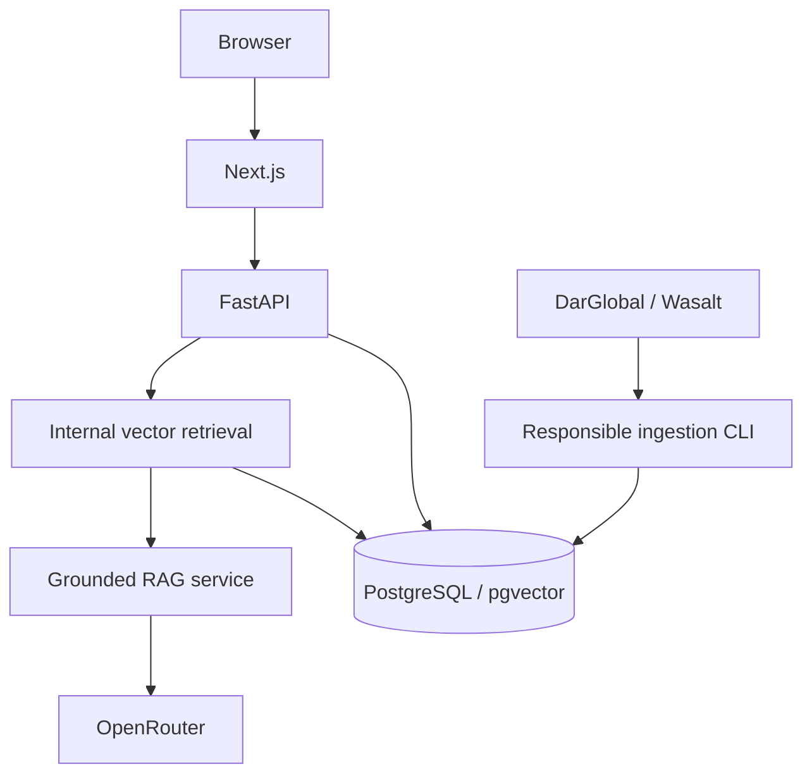

# Property Intelligence Assistant

A production-minded foundation for a grounded real-estate assistant using publicly available DarGlobal and Wasalt information. The completed product will retrieve relevant source material before generating answers and will show the supporting source links.

The application now includes the responsive grounded-chat frontend, hardened public API, and a
validated container deployment contract. It uses structured SSE, session-only conversation display,
backend-owned citation links, fixed source filters, and distinct refusal and provider error states.

## Architecture



This is a modular monolith: one frontend, one backend, and one relational database. Feature boundaries live inside the backend rather than being deployed as premature microservices.

## Requirements

- Python 3.12
- Node.js 20.9 or newer locally (the production image uses maintained Node.js 22)
- PostgreSQL 17 with pgvector, or Docker Compose
- Docker with Compose for the containerized workflow

## Local development

Copy the safe example configuration and adjust it for your machine:

```bash
cp .env.example .env
```

Start PostgreSQL separately, ensure the database in `DATABASE_URL` exists and supports pgvector, then start the backend:

```bash
cd backend
python3.12 -m venv .venv
.venv/bin/pip install --upgrade pip
.venv/bin/pip install -e '.[dev]'
set -a
. ../.env
set +a
.venv/bin/alembic upgrade head
.venv/bin/uvicorn app.main:app --reload --port 8000 --no-proxy-headers
```

In another terminal, start the frontend:

```bash
cd frontend
npm ci
npm run dev
```

Open `http://localhost:3000`. The API documentation is available at `http://localhost:8000/docs` in development/test environments only.

### Frontend behavior

The browser posts one independent question at a time to `/api/chat/stream`; previous messages stay
only in React memory and are never sent as model history or saved to local storage. The UI moves from
source search to answer preparation when the server emits `start`, then renders only a fully
validated `complete` response. It does not make a second fallback request if a stream fails.
Simple greetings and questions about the assistant itself are answered deterministically in the
browser, clearly labelled as non-grounded guidance, without consuming retrieval or provider quota.

Assistant output is rendered as plain React text with lightweight paragraph/list formatting. Raw
HTML is never interpreted. Source cards link only to canonical URLs supplied by the backend and use
`target="_blank"` with `rel="noopener noreferrer"`. The About data disclosure documents the public
corpus, manual imports caused by anti-automation controls, freshness limitations, and the need to
verify material details at the original source.

## Docker

The full local foundation is designed to start with:

```bash
cp .env.example .env
docker compose up --build
```

Services bind to loopback by default:

- Frontend: `http://localhost:3000`
- Backend: `http://localhost:8000`
- PostgreSQL: `localhost:5432`

Inspect or stop the stack with:

```bash
docker compose ps
docker compose down
```

Remove the development database only when intentionally discarding local data:

```bash
docker compose down --volumes
```

The images use digest-pinned multi-stage builds and non-root runtime users. The backend installs
CPU-only PyTorch and Compose persists the Hugging Face cache in a named volume. Compose applies
migrations for its single local backend only; production must run migrations and the private corpus
bootstrap as controlled release jobs. See [DEPLOYMENT.md](./DEPLOYMENT.md) for measured memory,
hosting choices, the exact 20-document/212-chunk bootstrap, and the production sequence.

## Environment variables

| Variable | Required | Purpose |
|---|---:|---|
| `APP_ENV` | Yes in deployment | `development`, `test`, or `production`; production disables all OpenAPI endpoints and tightens origin/provider checks |
| `APP_NAME` | No | Service name shown in OpenAPI and configuration |
| `LOG_LEVEL` | No | Structured log threshold |
| `DATABASE_URL` | Yes outside Compose | SQLAlchemy URL; must use `postgresql+asyncpg://` |
| `DATABASE_POOL_SIZE` | No | Per-process persistent PostgreSQL connection ceiling; default 5 |
| `DATABASE_MAX_OVERFLOW` | No | Per-process temporary overflow connections; default 5 |
| `DATABASE_POOL_RECYCLE_SECONDS` | No | Recycle interval for long-lived pooled connections; default 1,800 seconds |
| `FRONTEND_URL` | Yes in deployment | Exact comma-separated browser origins allowed by CORS; production rejects loopback by default |
| `NEXT_PUBLIC_API_BASE_URL` | Yes in deployment | Browser-safe public API origin; contains no secrets |
| `NEXT_PUBLIC_SITE_URL` | Yes in deployment | Public frontend origin used for canonical social metadata |
| `OPENROUTER_API_KEY` | Yes for answer generation | Backend-only credential; startup and safe refusals still work without it |
| `OPENROUTER_MODEL` | No | Configurable model/router identifier |
| `OPENROUTER_BASE_URL` | No | OpenRouter API root; defaults to `https://openrouter.ai/api/v1` |
| `OPENROUTER_TIMEOUT_SECONDS` | No | Total provider-call timeout |
| `OPENROUTER_MAX_RETRIES` | No | Bounded transient retries; maximum 5 |
| `EMBEDDING_MODEL` | No | Fixed local model: `BAAI/bge-small-en-v1.5` |
| `EMBEDDING_BATCH_SIZE` | No | Bounded offline embedding batch size |
| `EMBEDDING_PRELOAD` | No | Best-effort background model warm-up; recommended `true` per production process |
| `RAG_CHUNK_TARGET_CHARS` | No | Preferred deterministic chunk size |
| `RAG_CHUNK_OVERLAP_CHARS` | No | Maximum whole-line overlap target |
| `RAG_CHUNK_MIN_CHARS` | No | Preferred minimum final chunk size |
| `RAG_TOP_K` | No | Bounded retrieval result count |
| `RAG_SIMILARITY_THRESHOLD` | No | Calibrated evidence threshold; current default `0.61` |
| `RAG_CONTEXT_MAX_CHUNKS` | No | Maximum deduplicated chunks sent to generation |
| `RAG_CONTEXT_MAX_CHARS` | No | Maximum retrieved-text characters sent to generation |
| `MAX_CHAT_MESSAGE_LENGTH` | No | Normalized chat question limit; default 2,000 characters |
| `MAX_CHAT_BODY_BYTES` | No | Pre-parse public chat body limit; default 8 KB |
| `REQUEST_TIMEOUT_SECONDS` | No | Application request deadline configuration |
| `CHAT_RATE_LIMIT_REQUESTS` | No | Process-local requests allowed per chat window |
| `CHAT_RATE_LIMIT_WINDOW_SECONDS` | No | Fixed chat rate-limit window in seconds |
| `TRUSTED_PROXY_IPS` | No | Exact comma-separated proxy IPs allowed to supply forwarded client IPs |
| `ALLOW_LOCALHOST_ORIGINS` | No | Explicit production-only escape hatch for local validation; keep `false` publicly |
| `SCRAPER_USER_AGENT` | No | Descriptive crawler identity/contact; replace the example URL in production |
| `SCRAPER_CONNECT_TIMEOUT_SECONDS` | No | Per-connection HTTP deadline |
| `SCRAPER_READ_TIMEOUT_SECONDS` | No | Per-read HTTP deadline |
| `SCRAPER_TOTAL_TIMEOUT_SECONDS` | No | Total deadline for one fetch attempt |
| `SCRAPER_REQUEST_DELAY_SECONDS` | No | Minimum delay between requests |
| `SCRAPER_MAX_CONCURRENCY` | No | Bounded concurrent fetches, maximum 5 |
| `SCRAPER_MAX_RETRIES` | No | Transient retries only, maximum 5 |
| `SCRAPER_MAX_RESPONSE_BYTES` | No | Streaming response-size ceiling |
| `SCRAPER_DEFAULT_LIMIT` | No | Default detail-page cap per source |
| `POSTGRES_DB` | Compose only | Local database name |
| `POSTGRES_USER` | Compose only | Local database user |
| `POSTGRES_PASSWORD` | Compose only | Local-only password; replace for any deployment |
| `POSTGRES_PORT` | No | Loopback PostgreSQL port |
| `BACKEND_PORT` | No | Loopback backend port |
| `FRONTEND_PORT` | No | Loopback frontend port |

Only `NEXT_PUBLIC_*` values are included in browser code. They must contain public origins only. Database and OpenRouter credentials must never use that prefix. Production values belong in the deployment secret/configuration system and must not be committed.

## Health endpoints

### `GET /health`

Process liveness only. It does not call PostgreSQL or OpenRouter.

```json
{"status":"ok"}
```

### `GET /ready`

Readiness checks PostgreSQL with `SELECT 1`. It returns HTTP 200 when ready and HTTP 503 with a safe response when PostgreSQL is unavailable. Both endpoints return an `X-Request-ID` response header.

## Migrations

The initial Alembic migration enables pgvector:

```bash
cd backend
.venv/bin/alembic upgrade head
```

The second migration creates `documents`. The third creates `document_chunks` with a cascading
document foreign key and a fixed `vector(384)` column selected through the Phase 4 benchmark. Exact
sequential cosine search is intentional for the current 212 chunks; no approximate index is used.

## Data sources

- **DarGlobal:** public international project pages. With the configured descriptive crawler user agent, its robots file and declared sitemap are currently accessible and permit `/projects/`. The project index still returns an Imperva interstitial, so the adapter records the source as blocked and does not attempt a bypass.
- **Wasalt:** public Saudi project/property pages. Its accessible robots file allows most paths but explicitly disallows `/search`; discovery uses its declared English product sitemap only. Representative detail pages may still return Cloudflare challenges and are recorded as blocked.

## Scraping approach

The ingestion pipeline is sitemap/index first, never recursive. Every URL passes an exact HTTPS hostname allowlist, URL credential/IP/port checks, robots evaluation, manual redirect validation, content-type and streaming-size limits, conservative concurrency/delay, and bounded transient retries.

HTML is cleaned without an LLM. Semantic text order and optional property metadata are retained, then SHA-256 hashes support exact deduplication and changed-page detection. Database upserts make repeat runs insert, update, or skip predictably.

See [SCRAPING.md](./SCRAPING.md) for the revalidated source policy, threat controls, and implementation details.

## Running ingestion

Install the backend and load configuration as described above, run migrations, then invoke the CLI from the repository root:

```bash
set -a
. ./.env
set +a

backend/.venv/bin/python -m scripts.ingest --source wasalt --limit 10 --dry-run
backend/.venv/bin/python -m scripts.ingest --source darglobal --limit 10 --dry-run
backend/.venv/bin/python -m scripts.ingest --source all --limit 100
```

`--dry-run` performs policy checks, discovery, fetching, parsing, normalization, and validation without database writes. Add `--verbose` for DEBUG logs. There is deliberately no arbitrary URL option and no public ingestion API.

### Offline public-document import

When ordinary automated retrieval is blocked, legitimately obtained public HTML, TXT, JSON, or
PDF documents can be processed without any network fetching:

```bash
backend/.venv/bin/python -m scripts.import_documents \
  --source darglobal --path data/import/darglobal --dry-run

backend/.venv/bin/python -m scripts.import_documents \
  --source wasalt --path data/import/wasalt --dry-run
```

HTML, TXT, and PDF files require validated provenance sidecars. Imports accept only fixed
first-party domains, reject challenge/low-quality content, write a deterministic local JSONL
representation, and store `MANUAL_PUBLIC_IMPORT` provenance. Remove `--dry-run` to persist through
the same idempotent repository used by automated ingestion.

See [CORPUS_REPORT.md](./CORPUS_REPORT.md) for the Phase 3.5 investigation and current corpus gate.

## Vectorization and retrieval evaluation

After migration `20260825_0003` is applied and the normalized corpus is present in PostgreSQL,
build or refresh derived chunks from the repository root:

```bash
backend/.venv/bin/python -m scripts.embed_documents
```

The command loads `BAAI/bge-small-en-v1.5` once, chunks documents deterministically, embeds only
new or changed documents, and transactionally replaces stale chunks. A repeat run with unchanged
documents reports 20 unchanged documents and 212 skipped chunks.

Run the checked-in model comparison and database-backed retrieval evaluation with:

```bash
backend/.venv/bin/python -m scripts.benchmark_embeddings
backend/.venv/bin/python -m scripts.evaluate_retrieval
```

The retrieval and generation services remain internal. Phase 6 exposes them only through the narrow,
server-controlled `/api/chat` and `/api/chat/stream` contracts.

## Grounded generation evaluation

Run the deterministic 30-case evaluation against the real PostgreSQL corpus with a scripted
provider double:

```bash
backend/.venv/bin/python scripts/evaluate_generation.py
```

This evaluates orchestration, evidence refusal, context selection, citations, source attribution,
and injection handling. It does **not** claim model quality. If `OPENROUTER_API_KEY` is configured,
run a separately labelled, rate-conscious live sample:

```bash
backend/.venv/bin/python scripts/evaluate_generation.py --live --live-limit 5
```

The default provider model is configurable and remains `openrouter/free`. The direct HTTP client
uses the OpenAI-compatible chat-completions endpoint, an explicit connect/total timeout, exponential
backoff for transient transport errors, `408`, `429`, and selected `5xx` responses, and no retries
for permanent `4xx` failures. Requests require a strict `answer`/`citations` JSON schema and
providers that support the requested parameters; an absolute wall-clock deadline also covers
providers that send response headers but stall the body. Free-model availability and rate limits
are provider constraints, so the application returns safe categories rather than leaking provider
bodies. See
[OpenRouter's chat API](https://openrouter.ai/docs/api/api-reference/chat/send-chat-completion-request)
and [free-tier FAQ](https://openrouter.ai/docs/faq).

## Public chat API

`POST /api/chat` accepts only a message and optional fixed source filter:

```json
{"message":"Which DarGlobal residence has Aston Martin interiors?","source":"darglobal"}
```

Successful and refused requests both return HTTP 200 with `answer`, `refused`, backend-controlled
`sources`, and `request_id`. Refusals contain no sources. Clients cannot set model names, prompts,
retrieval depth, thresholds, SQL, or arbitrary instructions.

`POST /api/chat/stream` accepts the same body and returns SSE. It emits `start`, followed by either
one fully validated `complete` event or a safe `error` event. It deliberately does not relay raw
provider tokens: buffering until groundedness and citation validation finish prevents partial
hallucinated URLs and unknown citations from reaching clients. Disconnect cancellation propagates
through the async RAG/OpenRouter call where the ASGI server supports it.

The branded-interiors corpus question uses two explicit DarGlobal retrieval queries and a
document-title-backed deterministic response. This prevents repeated chunks from one brochure from
crowding out the second brochure and avoids depending on a free provider for facts already encoded
in canonical source titles.

Example non-streaming response:

```json
{
  "answer": "The Astera has interiors by Aston Martin.",
  "refused": false,
  "sources": [{"id":"S1","title":"The Astera","url":"https://...","source":"DarGlobal"}],
  "request_id": "..."
}
```

Provider failures map to stable responses: timeout `504`, invalid output `502`, and provider
unavailability/rate limiting `503`. Raw provider bodies are never returned.

Both chat routes share a fixed-window limiter, defaulting to 10 requests per 60 seconds per client.
It runs before the 8 KB body buffer and JSON parsing, so malformed and oversized attempts also consume quota. `X-Forwarded-For` is ignored
unless the direct socket peer is listed in `TRUSTED_PROXY_IPS`; a trusted proxy must overwrite or
correctly append the header. The limiter is process-local and intentionally simple. Multiple API
instances require a shared atomic store such as Redis or a platform edge limiter.
Uvicorn is run with `--no-proxy-headers` so it cannot rewrite the socket identity before this policy
runs; proxy trust is owned in one place by the application.

OpenAPI `/docs` and `/openapi.json` are enabled only in development/test. `/redoc` is always disabled. Production disables all three
because the current consumers use a known, narrow contract. `/health` remains process-only and
`/ready` checks PostgreSQL, not OpenRouter: temporary model-provider downtime should produce a safe
chat error, not restart otherwise healthy application instances.

The embedding model remains lazy by default for ordinary local commands. Setting
`EMBEDDING_PRELOAD=true` starts one best-effort background warm-up per API process without delaying
`/health` or failing startup. The same locked cache is used by warm-up and requests, preventing
duplicate in-process model instances. Compose enables preload for its production-style backend.

Before any deployment, follow [PRODUCTION_CHECKLIST.md](./PRODUCTION_CHECKLIST.md). The local Compose
defaults are development conveniences, not production credentials or public binding guidance.

See [ARCHITECTURE.md](./ARCHITECTURE.md) for model comparison, chunking rules, metric consistency,
index rationale, measured results, and scaling trade-offs.

### Known source limitations

DarGlobal's robots policy is available to the configured crawler identity, but its project index is blocked by an Imperva interstitial. Wasalt's product sitemap is accessible, but detail pages can be challenged by Cloudflare. The pipeline records these limitations rather than bypassing them or inventing source data.

## Quality checks

Backend:

```bash
cd backend
.venv/bin/ruff check .
.venv/bin/pytest
```

Frontend:

```bash
cd frontend
npm run lint
npm run typecheck
npm test
npm run build
```

After both dependency sets are installed, all checks can be run from the repository root with `./scripts/verify.sh`.

## Security foundation

- Secrets are backend-only environment variables and `.env` is ignored.
- CORS uses explicit configured origins, never a wildcard.
- Unhandled production errors return a request ID and generic message while details stay in structured server logs.
- Requests receive validated correlation IDs and baseline browser security headers.
- PostgreSQL is accessed through SQLAlchemy's async engine/session lifecycle.
- There is no ingestion or administration endpoint in this phase.
- Public document text remains inert input to embedding only; it is never executed or interpreted
  as code.
- Vector retrieval uses typed SQLAlchemy expressions and fixed source filters, not arbitrary SQL.
- Retrieved documents are untrusted user-message data, never system instructions.
- Citation IDs are validated against context and mapped to URLs exclusively from backend metadata.
- Model answers containing URLs, unknown citation IDs, or uncited factual output are rejected.
- Logs contain timings and aggregate retrieval facts, not keys, full prompts, questions, or chunks.
- Malformed payloads receive a generic structured validation error without echoing their contents.
- Chat responses use `Cache-Control: no-store`; SSE additionally disables proxy buffering.
- Containers use non-root runtime users and do not bake `.env` files into images.

## Architecture records

See [architecture](./ARCHITECTURE.md), [security](./SECURITY.md),
[Phase 1 discovery](./PHASE_1_DISCOVERY.md), and [interview notes](./INTERVIEW_NOTES.md) for the
approved design, trade-offs, threat model, and implementation milestones.
